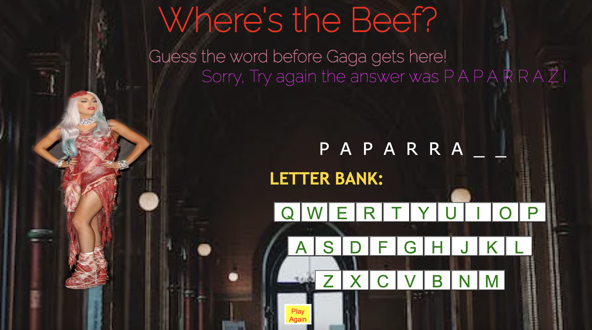

# SpaceDude GAME

    > Guess the word given using the letters provided before Lady Gaga appears 

## How the Game Works 

    - using the provided letters, a word will pop up and you'll be able to guess it. 

    -as you begin clicking letters, wrong answers will result in pieces of Lady Gaga to appear 

    -if you complete the word before 6 tries, you win. If not, Lady Gaga is finalized and you will be prompted that you lost with the correct word displayed. 

    -Once you've completed the game by either winning or losing, you may click the play again button to restart the game over. 

### Game Look 
    ![Game Start]
    
    (imgs/Lady-Gaga-Start.png)
       

    

#### Technologies Used 
    - JavaScript
    - HTML
    - CSS 

#### Getting Started 

click to play: [SpaceDude] (https://mjmickd.github.io/SpaceDude/)

### Icebox Features
    -I would like to add a catergory feature that there could be other artists incoporated into the game 

    -I would like there to be a hint feature 

    -I would like there to be a feature that would show the amount of wins you've collected total. 
